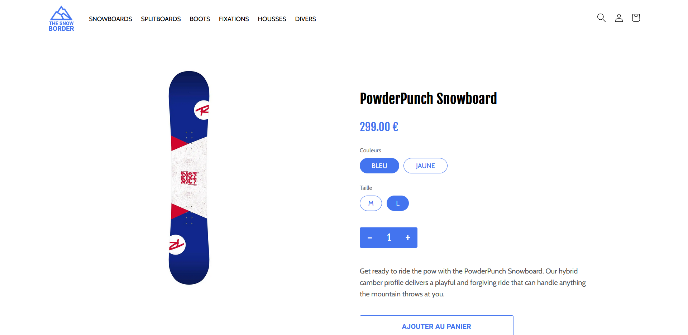

# Lugus-Shopify - Test technique "Snow Border"

Création d'une page produit dynamique pour présenter un snowboard fictif avec les éléments suivants : description,
variantes, images et évaluations.

## Table of contents

- [Screenshot](#screenshot)
- [My process](#my-process)
- [Built with](#built-with)
- [Useful resources](#useful-resources)
- [Author](#author)

### Screenshot

## My process

- Étape 1 : Préparation du dossier projet.

Pour commencer, j'ai créé un dossier pour mon projet. À l'intérieur de ce dossier, j'ai ajouté un fichier index.html.
J'ai également créé un dossier appelé "assets" où j'ai placé mon fichier SCSS ainsi que les fichiers SVG nécessaires.
J'ai configuré mon environnement de développement pour compiler les fichiers SCSS en un seul fichier CSS dans un dossier
appelé "dist".

- Étape 2 : Intégration de la maquette figma.

Ensuite, après avoir analysé la maquette Figma, j'ai commencé à construire la structure HTML de la page. J'ai commencé
par créer les éléments du header et du footer, puis je me suis attaqué aux différentes sections de la page. Une fois
l'HTML terminé, j'ai divisé mon SCSS en plusieurs fichiers, associant chaque fichier à une partie spécifique de
l'HTML. Cela m'a permis de mieux organiser mon code et de le rendre plus maintenable.

Ensuite, j'ai ajouté des règles CSS spécifiques aux médias queries pour rendre la page responsive. J'ai utilisé les
media queries pour appliquer des styles différents en fonction de la taille de l'écran, assurant ainsi une expérience
utilisateur optimale sur différents appareils et résolutions.

- Étape 3 : Ajout du JavaScript.

Pour finir, j'ai ajouté le code JavaScript nécessaire pour afficher dynamiquement les données provenant de l'API et pour
ajouter diverses autres fonctionnalités à la page. J'ai utilisé les méthodes et les événements JavaScript pour manipuler
le DOM et interagir avec les éléments de la page.

Par exemple, j'ai utilisé fetch API pour récupérer les données de l'API et les afficher de
manière dynamique dans les différentes sections de la page. J'ai également utilisé des écouteurs d'événements pour
détecter les actions des utilisateurs, comme les clics sur des boutons, et réagir en
conséquence.

J'ai écrit des fonctions JavaScript pour gérer ces actions, en utilisant des sélecteurs pour cibler les éléments HTML
spécifiques et en mettant à jour leur contenu ou leurs attributs en fonction des interactions de l'utilisateur.

### Built with

- HTML
- SCSS
- JavaScript
- IntelliJ

### Useful resources

- [ MDN ](https://developer.mozilla.org/fr/)
- [ DevDocs ](https://devdocs.io/)
- [ StackOverflow ](https://stackoverflow.com/)

## Author

- LinkedIn - [Léon Gallet](https://www.linkedin.com/in/l%C3%A9on-gallet/)
- GitHub - [Nelo0o](https://github.com/Nelo0o)
